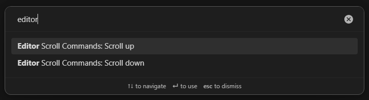
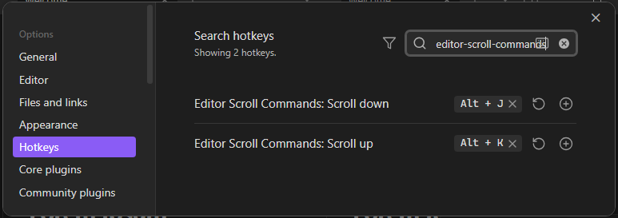
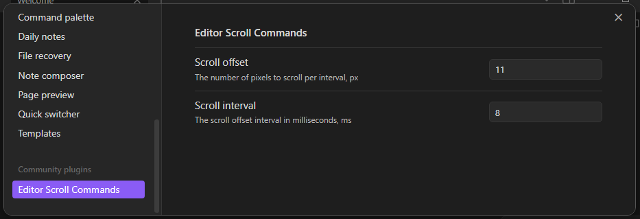

# Obsidian Scroll Editor Plugin

This plugin adds scroll commands for the Obsidian editor.

The plugin adds `scroll-up` and `scroll-down` commands to the editor. Assign hotkeys to these commands to
scroll the editor view.

The commands itself do nothing, so use the hotkeys to scroll the editor.

The settings allow you to change the scroll offset, the interval, and some acceleration parameters.

## Development

- Clone this repo.
- Make sure your NodeJS is at least v16 (`node --version`).
- `npm i` or `yarn` to install dependencies.
- `npm run dev` to start compilation in watch mode.

## Manually installing the plugin

- Copy over `main.js`, `manifest.json` to your vault `VaultFolder/.obsidian/plugins/obsidian-editor-scroll-commands/`.

See the [latest release](https://github.com/PhoSor/obsidian-editor-scroll-commands/releases/latest) in the **Releases** section.
